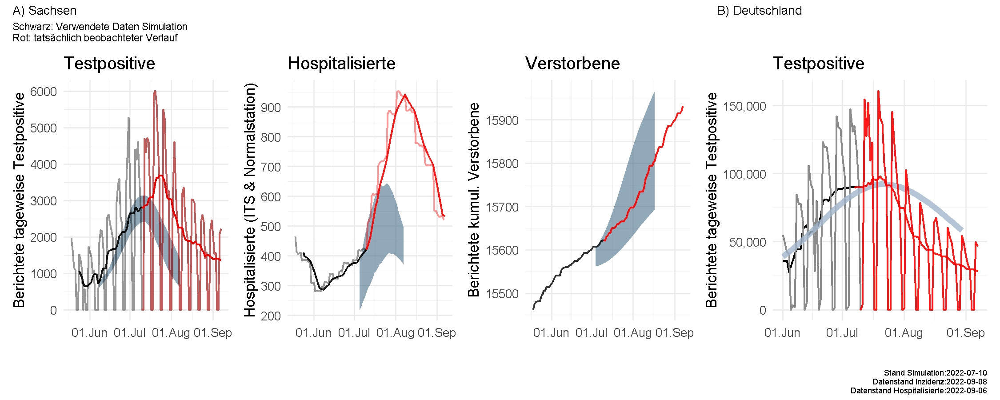

# IMISE-Epidemiologisches-Bulletin-23

Additional Details for the Epidemiological [bulletin 23](https://www.imise.uni-leipzig.de/sites/www.imise.uni-leipzig.de/files/files/uploads/Medien/bulletin23_covid19_sachsens_2022_06-14_finaldocx.pdf) of the IMISE Leipzig regarding the development of COVID-19 in Saxony and Germany. Parameters for the agent-based model are [here](https://github.com/GenStatLeipzig/IMISE-Epidemiologisches-Bulletin-23/blob/main/Modelling%20Detail_MOCOS%20SECIR_to_Clarify_to_Add_to_Website.pdf).

### Comparison observed data with described scenarios

#### BA.5-wave in summer 2022:

Black line shows data used for modelling (for test-positives and hospitalized people mean of 7 days, right-centric, see bulletin), red indicates data observed later. The light oscillating lines are daily reported data. Grey shaded areas denote the range where most modelled trajectories were found (95% confidence interval).

***Modellierte Szenarien zur Ausbreitung der Omikron-BA.4/BA.5 Variante im Sommer für A) Sachsen und B) Deutschland.***

*Die hellgraue Linie stellt die berichteten Daten dar, die schwarze Linie den 7-Tage-Mittelwert. Die Modellvorhersage ist blaugrau gekennzeichnet, ein schattierter Bereich in A entspricht den häufigsten in den Modellierungen berechneten Verläufen (als 95% Unsicherheitsbereich). Als hospitalisiert werden Patienten auf Normalstation plus ITS gezählt.*

*Methodik:  A) Agentenbasiertes Modell von Sachsen, B) -Erweitertes SECIR- Model von Deutschland. In den Modellen wurde die Altersstruktur, der Impf- und Genesenenstatus, der zeitabhängige Rückgang des Immunschutz vor Ansteckung („Waning“) berücksichtigt und ein Wegfall der CORONA-Maßnahmen sowie eine zeitlich variable Dunkelziffer angenommen. Datenquelle: Berichtete Daten vom RKI nach ingangsdatum mit rechtszentriertem gleitenden 7-Tage Mittelwert; Simulation Agenten Sachsen: MOCOS, Technische Universität Wroclaw, Simulation SECIR Deutschland: GenStat IMISE Universität Leipzig;*

